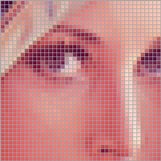
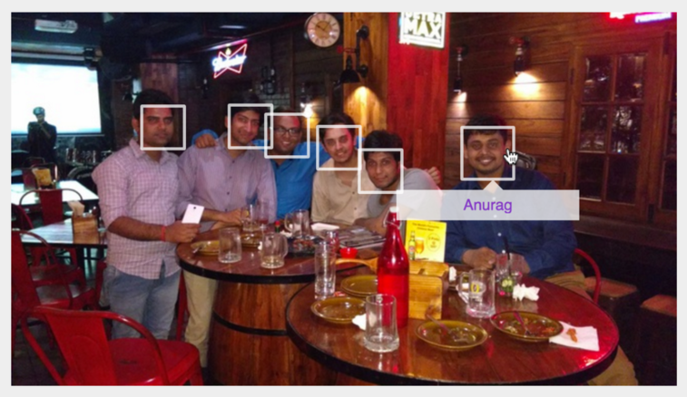
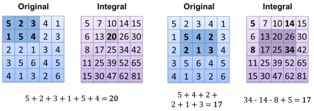
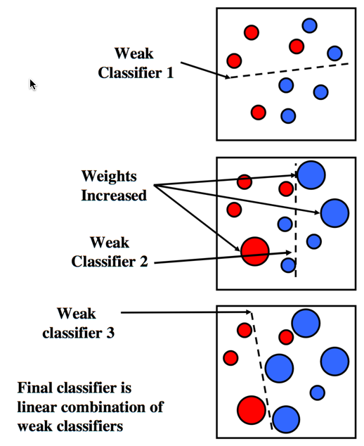
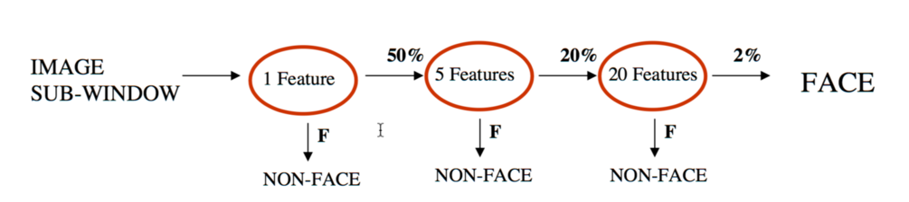
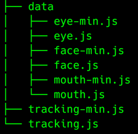

# COMPUTER VISION

**What is it...**

>Computer Vision is mimicking the abilities of human vision by electronically perceiving and understanding an image.

It is a broad term and includes a lot of domains like Gesture Recognition, Optical Character Recognition, Face detection and a lot more.

In this article, we will be focussing on **face detection** and try to understand the key ideas that allow us to detect human faces in real time.

---

#### It all begins with a pixel!

As shown below, a digital representation of an image comprises a large number of pixels depending on the resolution of the image.

Each pixel represents the smallest unit containing the information about how the image will be rendered on a digital device.

Each pixel can be represented by 4 bytes ( 1 byte each for red, green, blue and alpha ).

---

#### What Face Detection is...?

It is essentially processing a raw image to :
- Detect the presence of **human** faces, if any.
- Extract info about the coordinates and size of those human faces.

#### How do we do it... 

That's what this article is all about.

Before we dive into the implementation details, let’s discuss the **framework** that most of the modern face detection systems use... the Viola Jones Object Detection Framework.

---

#### VIOLA JONES OBJECT DETECTION FRAMEWORK

>**The training is slow, but the detection is fast.**
>
> This framework introduced three key ideas:
> 1. Integral image representation
> 2. Construction of classifier by Adaptive Boosting
> 3. Combining successively more complex classifiers in a cascade structure
>

Let's see what each of these are... 

---

#### INTEGRAL IMAGE REPRESENTATION

##### Features instead of Pixels

This framework focuses on using features rather than pixel for computing.

##### What exactly a feature is...

Let's see an example to understand what a feature is...

As explained [here](https://en.wikipedia.org/wiki/Viola–Jones_object_detection_framework), all human faces share some similar properties:

- The eye region is darker than the upper-cheeks.

- The nose bridge region is brighter than the eyes.

>Using features has an obvious benefit in facilitating training data because they can encode critical domain knowledge.

The way these features are used involves computation of difference between sum of intensities of the pixels in light and dark regions.

> **Value = Σ (pixels in black area) - Σ (pixels in white area)**

The above step is a key operation as it is repeated a number of times with regions of varying sizes and coordinates. Therefore, it certainly need to be efficient to achieve overall efficiency.

This is where the idea of Integral image representation comes handy.

##### What exactly is an Integral Image representation

> **An intermediate representation allows us to quickly compute intensities of an area independently of the size of the region with a computational complexity from O(1) instead of O(n)**

As explained [here](http://www.codeproject.com/Articles/441226/Haar-feature-Object-Detection-in-Csharp)

- The value of the integral image at a point is the sum of all the pixels above and to the left.

- The sum of the pixels within a rectangle can be computed with four array references.

---

#### CONSTRUCTION OF CLASSIFIER BY ADAPTIVE BOOSTING

##### What's a classifier...?
> A **classifier** is a function that takes the values of various features in an example (image to be tested in our case) and predicts the class that that example belongs to (whether it contain human face or not, in our case).

- A classifier is called a **weak classifier** if it cannot be used *alone* to predict the class to which an example belongs to. It is generally computationally economical.
- On the contrary, a classifier is called a **strong classifier** if it can be used *alone* to classify the example. It is generally computation intensive. 

---

There can be a large number of rectangle features associated with each image sub-window.... infact, they can be far larger than the number of pixels.

> As Viola and Jones hypothesized, **a relatively smaller number of features could be used to form an effective classifier.**
> 
>The big question - **Which features to select?**

Viola and Jones used variant of **AdaBoost** to select the features as well as to train the classifier

##### What's AdaBoost... ?

> Adaptive Boosting a.k.a AdaBoost is a learning algorithm which is used to boost the performance of a simple classifier.

Below is a conceptual overview of how adaptive boosting works:

- The training data ( a collection of positive and negative samples i.e. the images with and without a human face ) is fed into a weak classifier.
- After the first round of learning, the weights are normalized for the examples ( training data images ) to emphasize on those which were incorrectly classified by the previous classifier.
- This process is repeated until we get the required accuracy of the classifier.
- The final result is a strong classifier which is a linear combination of a number of wieghted weak classifiers followed by a threshold.

> **Thankfully, for our purposes (human face detection), we do not need to train our own classifier.** 
>
>Instead, we will be using the classifier training data provided by an open source [OpenCV](http://opencv.org/) library.

---

#### THE ATTENTIONAL CASCADE

> The key insight is that **smaller, and therefore more efficient, boosted classifiers can be constructed which reject many of the negative sub-windows while detecting almost all positive instances.**

The idea is to use simpler classifiers to reject majority of negative sub-windows thereby focussing the attention to only the promising regions of the image.

The end result is an overall efficiency due to **reduction in input sub-windows for the compuationally expensive classifiers.**

---

#### SEEING IT IN ACTION...

Below is a video that visualizes the detection process of OpenCV's face detector. 

The algorithm uses the Viola Jones method :

- An integral image is calculated. 
- Some calculations are done on all the areas defined by the black and white rectangles to analyze the differences between the dark and light regions of a face. 
- The sub-window (in red) is scanned across the image at various scales to detect if there is a potential face within the window. 
- If not, it continues scanning. 
- If it passes all stages in the cascade file, it is marked with a red rectangle. 
- In the post-processing stage all the potential faces are checked for overlaps.  

<a href="https://vimeo.com/12774628">OpenCV Face Detection: Visualized</a> from <a href="https://vimeo.com/adamhrv">Adam Harvey</a>.

---

#### HOW DO I USE FACE-DETECTION IN MY AWESOME WEB PROJECT...?

We have survived the theory, let's come to implementation part.

Depending on the nature of the requirement, we can go with one of the below options:

> I. IMPLEMENT YOUR OWN CLOUD

The **most flexible and powerful** way would be to manage your own cloud solution.

- You get to **control the training of the classifiers and every aspect of it.**
- You may use some open source libraries like **OpenCV** which has implemented more than 2500 machine learning algothims implemented and has C++, C, Python, Java and MATLAB interfaces... which mean you can **easily interface it with node server** via [node-opencv](https://github.com/peterbraden/node-opencv)
- However, this approach has its own **maintenance overheads** which becomes critical once you scale your app.
- Another potential drawback would be that the image need to be transmitted over the network to the server. In simple scenarios e.g. tagging of friends etc.. we might go with implementing a client side solution only.

> II. USE A THRID PARTY LIBRARY

- You may easily get up and running by delegating all the maintenance and setup chores to some third party service providers like **Google Cloud Vison API** or the one provided by **Microsoft.**
- These providers already have an **exhaustive training data backing up their classifiers**. They also support advanced features such as **Explicit Content Detection.**
- These services are usually **paid**.
- This solution is highly recommended till the pay as you use amounts balances out the resources to set up and train you own classifier which usually takes time to fine tune.
- The common potential drawback of **image transmitted over network** remains.

> III. USE A CLIENT SIDE JS LIBRARY

- The computation is delegated to the client but **image is not transmitted over the network to detect faces.**
- This solution is particularly valuable **when we need to support simple requirements** like tagging of friends, or focussing on area of image with the face etc.
- One of the popular library to support this is [trackingjs](https://trackingjs.com/)
- **Simplest to implement**.

---

#### USING TRACKINGJS TO IMPLEMENT FACE DETECTION

You can install this library by simply typing

<pre style="background:#fff;color:#000">npm install tracking
</pre>

Once installed, this library has the following files in the build directory

- The files in the data folder contains the classifiers. You need to include the appropriate classifier based on what you need to detect.
- So basically, we need to include the tracking library and one ( or more depending on use case ) of the classifiers and we are all set.

The classifier data looks like as shown below.

Below is a code snippet from the examples provided on the trackingjs site.

Using this library involves just the following steps:

- Require trackingjs and appropriate classifier ( from the data directory )
- **Instantiate a tracking.ObjectTracker** with the name of the classifier to use.
- Set appropriate **callback on the tracker for the track** event.
- Trigger the tracker by simply invoking **tracking.track** with the element ( can be image / video / canvas ) and the tracker as the arguments.

<pre style="background:#fff;color:#000">
    window.onload = function() {
      var img = document.getElementById('img');
      // We need to detect face... instantiate a new ObjectTracker with 'face' as an argument
      // IMPORTANT: We need to include appropriate classifier.
      var tracker = new tracking.ObjectTracker('face');

      // Set up appropriate listeners for track event
      tracker.on('track', function(event) {
        event.data.forEach(function(rect) {
          // Do something with the faces identified in the image.
          plotRectangle(rect.x, rect.y, rect.width, rect.height);
        });
      });

      // Invoke the track
      tracking.track(img, tracker);
    }
</pre>

So that was an introduction to face detection. I hope you enjoyed reading it.